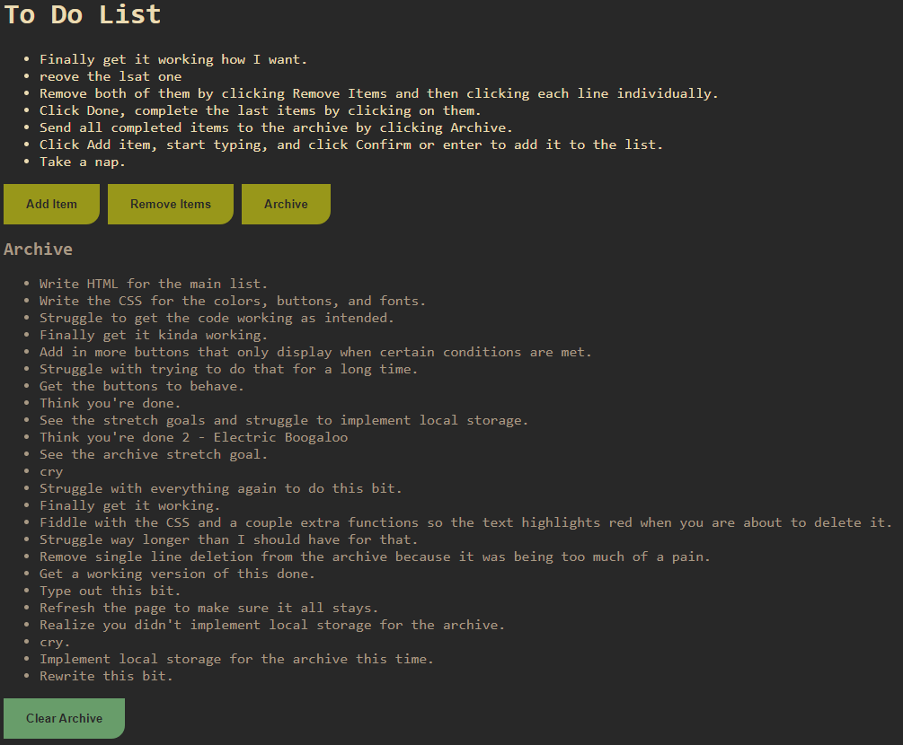

This project is an HTML/JavaScript based To-Do list.
  

You can do the following things with this project.
    
    Add items to the to-do list.
        Can confirm the item either by the 'Confirm' button or by pressing ENTER.
    
    Remove single items from the main to-do list.
        Click the 'Remove Items' button, and then click the items you want to delete. Then click Done.
    
    Complete Items on the to do list.
        Just click them and it will receive a strikethough!
    
    Archive Completed Items
        Click 'Archive' and all completed items will get sent to the archive.
    
    Clear the Archive
        Click 'Clear Archive' to remove everything out of the archive.
